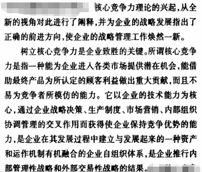
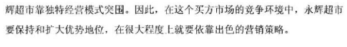

# OM 02 Assignment

## 目录

[TOC]

## 1.美团与滴滴的战略是否成功？为什么？

成功的，成功抢占了市场，主导整个市场动向。

业内有传说，说团购时期美团有一个战略叫“农村包围城市”，相信在座有不少人也听到过的。2013年、2014年、2015年，这三年在市场上做团购业务的主要同行是美团、大众点评和糯米，当时的美团大概开了100多个城市，大众点评和糯米基本上是20-30个城市。因为美团的城市比大众点评和糯米多很多，所以就被外界广泛认为是“农村包围城市”。假设这是一个既定的策略，那么这个策略其实是很有效的。当时因为美团和糯米、大众点评存在城市差异，所以美团很多尾部城市是能够盈利的，然后再把这些盈利的钱拿到头部城市，继续跟糯米和大众点评拼，这样糯米和点评就会很吃亏。现在美团跟点评合并了，糯米也基本消失了，从最后的数字成果来看，大家认为美团的策略是非常成功的。

回顾滴滴的发展历程，一直伴随着激烈的竞争，赢得市场份额是战争时期必须要完成的任务，大家拼的是补贴效率，营销创意，执行力，但是对于商业内核的研究，却远远不够深入。目前滴滴的五大战略之首是“修炼内功”，也就是不断提升为用户创造价值的能力。

平台的使命是深入地研究用户需求，发现并定义新的业务机会，为整体平台的用户增长、用户黏性负责；品类需要聚焦不同的客户群体，深入研究、定义相匹配的服务标准和品牌形象，同时根据用户需求持续进行迭代；大区则是直接面对本地用户，挖掘本地市场机会，统筹运营不同业务线，为整体业务结果负责。

## 2.核心竞争力与公司战略之间的关系？

p44

## 3.应用波特五力模型分析新零售行业中的永辉bravo

## 4. 公司如何通过内外部分析，来确定公司战略？

外部分析：识别机会与威胁p36
宏观环境PEST
行业环境与竞争环境 波特五力

内部分析：确认资源与竞争优势p38
价值链

战略选择p41

企业在制定其发展战略之前，需要对外部经营环境和自身内部条件进行全面分析，以便制定出适合自身发展且能够指导企业运营管理的战略方向和目标。
具体战略分析如下：
一、外部环境分析
1、企业宏观环境分析 
主要包含对政治法律环境、经济环境、技术环境、社会文化环境的分析，即战略制定者非常熟悉的PEST分析，其中政治法律环境分析主要涉及到的因素有：政府政策、政府管制、国家政局、特种关税、进出口限制等；经济环境分析涉及到的有：经济增长率、财政和货币政策、利率、汇率、消费模式、投资、通货膨胀、可支配收入、劳动生产率水平等；技术环境分析涉及到的有：技术总体水平、技术突破、产品生命周期、技术变更速度、技术发展趋势等；社会文化环境分析涉及到的有：教育水平、生活方式、社会价值观、工作习惯、社会习俗、人口规模与分布等。 
进行企业宏观环境分析，主要目的是为了认清外部宏观环境的形势，从而确定对企业经营管理有哪些方面的影响，并采取相应的措施来制定自身发展的策略。例如：国家宏观

## 5.距离垂直一体化和横向一体化的公司。他们之间是否有什么联系？

### 1、概念不同：

纵向一体化又叫垂直一体化，指企业将生产与原料供应，或者生产与产品销售联合在一起的战略形式，是企业在两个可能的方向上扩展现有经营业务的一种发展战略，是将公司的经营活动向后扩展到原材料供应或向前扩展到销售终端的一种战略体系。
横向一体化战略也叫水平一体化战略，是指为了扩大生产规模、降低成本、巩固企业的市场地位、提高企业竞争优势、增强企业实力而与同行业企业进行联合的一种战略。

### 2、目的不同：

纵向一体化的目的：是为加强核心企业对原材料供应、产品制造、分销和销售全过程的控制，使企业能在市场竞争中掌握主动，从而达到增加各个业务活动阶段的利润。
横向一体化是资本在同一产业和部门内的集中，目的是实现扩大规模、降低产品成本、巩固市场地位。国际化经营是横向一体化的一种形式。

### 3、方式不同：

企业增长在战略上可分为一体化扩张和多样化扩张。一体化扩张又可分为横向一体化（水平一体化）和纵向一体化（垂直一体化）。

## 6.格力案例分析，完成课后三个问题。

### 1）格力电器成功实行专业化战略的因素是什么？

格力电器自从选择了空调专业化道路以来，就一路坚持，在专业化的过程中，专注于空调的技术创新，专注于精品意识的培育，专注于品牌含金量的锻造，专注于产品可靠性的试验和研究，专注于不同气候环境下的产品适应性的提升。以专业的态度、精深的技术，坚持做到把质量隐患消灭在售前，从整体上增加空调产品的高科技含量，满足区域市场对产品的特殊技术要求。

### 2）你认为格力电器下一步应该向多元化发展吗？

应该。企业发展已经遇到瓶颈。必然会走向多元化，早就在布局多元化了，其名下大家电小家电规模也不小，应该会跟美的差不多搞个整体上市之类的举动，如果不走多元化，紧靠单一的产品肯定是走不下去的。

### 3）你认为格力电器采用的是什么竞争战略？

公司战略：专注单一事业
经营战略：成本领先战略
全球运作战略：全球化战略