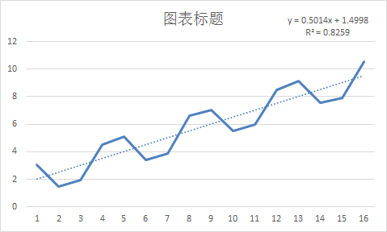
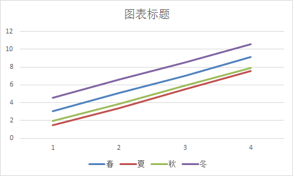

# OM03 Assignment

[TOC]

# 1.预测误差R和R平方取值及其意义？

$R$度量数据之间的线性相关性， 相关系数是一个评价两个变量线性相关度的指标。在线性拟合中可以通过拟合结果和实测值得相关系数来反应拟合结果和实测结果线性相关度。但是如果本来就用的非线性拟合（多项式、曲线），那这个指标对于评估拟合没有任何意义。
$R^2$是一个评价拟合好坏的指标。这里的拟合可以是线性的，也可以是非线性的。即使线性的也不一定要用最小二乘法来拟合。 

$R$是相关系数，相关有很多种类型（线性和非线性）。一般情况下我们用的r指的是皮尔森相关系数，它指的是一种线性相关，范围从-1到1。-1指负相关，1指正相关。0指的是不存在线性相关。
$R^2$是相关系数r的平方。我们通常说的$R^2$是把皮尔森相关系数的这个r平方得到的r2。这里$R^2$指的是在最佳拟合线（线性关系）中可以解释的比例。例如y和x的r2=0.7的话，也就是70%的y的变化可以由x和y的这条最佳拟合线来解释，剩余30%受其他因素影响。

$R$：一般用来度量数据之间的线性相关性，通常分为三种：Spearman，Pearson和kendall，在SPSS中也能直接使用，$R$的定义如下图公式（1）所示： 
$$
R=\frac{Cov(X, Y)}{\sigma(X) * \sigma(Y)}
$$
$$R^2$$:

$$R^2$$起源于数学统计上，在一个线性模型中，我们通常使用它去评估该模型线性拟合度的高低，对于$R^2$的定义如下图公式（2）所示，其中

SST：总平方和（类似于方差）

SSR：回归平方和（SST-SSE）

SSE：残差平方和（实际值与模型预测值/观察值之间样本总的差异）
$$
R^2=1-\frac{\sum_i(\hat{y_i}-y_i)^2}{\sum_i(\overline{y_i}-y_i)^2}
$$

# 2.判断预测准确度的常用度量指标有哪些？

$MAD$ 

$MSE$  

$R^2$


# 3.SVM和NN的区别

SVM白盒，NN黑盒
SVM小规模数据集，NN大规模数据集
SVM多分类问题难，NN更容易过拟合
SVM学习速度快，NN学习速度慢

## 3.1 SVM优缺点

SVM有如下主要几个特点：

(1)非线性映射是SVM方法的理论基础,SVM利用内积核函数代替向高维空间的非线性映射； 
(2)对特征空间划分的最优超平面是SVM的目标,最大化分类边际的思想是SVM方法的核心； 
(3)支持向量是SVM的训练结果,在SVM分类决策中起决定作用的是支持向量。 
(4)SVM 是一种有坚实理论基础的新颖的小样本学习方法。它基本上不涉及概率测度及大数定律等,因此不同于现有的统计方法。从本质上看,它避开了从归纳到演绎的传统过程,实现了高效的从训练样本到预报样本的“转导推理”,大大简化了通常的分类和回归等问题。 
(5)SVM 的最终决策函数只由少数的支持向量所确定,计算的复杂性取决于支持向量的数目,而不是样本空间的维数,这在某种意义上避免了“维数灾难”。 
(6)少数支持向量决定了最终结果,这不但可以帮助我们抓住关键样本、“剔除”大量冗余样本,而且注定了该方法不但算法简单,而且具有较好的“鲁棒”性。这种“鲁棒”性主要体现在: 
①增、删非支持向量样本对模型没有影响; 
②支持向量样本集具有一定的鲁棒性; 
③有些成功的应用中,SVM 方法对核的选取不敏感

两个不足：

(1) SVM算法对大规模训练样本难以实施 
由于SVM是借助二次规划来求解支持向量，而求解二次规划将涉及m阶矩阵的计算（m为样本的个数），当m数目很大时该矩阵的存储和计算将耗费大量的机器内存和运算时间。针对以上问题的主要改进有有J.Platt的SMO算法、T.Joachims的SVM、C.J.C.Burges等的PCGC、张学工的CSVM以及O.L.Mangasarian等的SOR算法 
(2) 用SVM解决多分类问题存在困难 
经典的支持向量机算法只给出了二类分类的算法，而在数据挖掘的实际应用中，一般要解决多类的分类问题。可以通过多个二类支持向量机的组合来解决。主要有一对多组合模式、一对一组合模式和SVM决策树；再就是通过构造多个分类器的组合来解决。主要原理是克服SVM固有的缺点，结合其他算法的优势，解决多类问题的分类精度。如：与粗集理论结合，形成一种优势互补的多类问题的组合分类器。

## 3.2 神经网络优缺点

多层前向BP网络的优点：

网络实质上实现了一个从输入到输出的映射功能，而数学理论已证明它具有实现任何复杂非线性映射的功能。这使得它特别适合于求解内部机制复杂的问题； 
网络能通过学习带正确答案的实例集自动提取“合理的”求解规则，即具有自学习能力； 
网络具有一定的推广、概括能力。

多层前向BP网络的缺点：

BP算法的学习速度很慢，其原因主要有：

由于BP算法本质上为梯度下降法，而它所要优化的目标函数又非常复杂，因此，必然会出现“锯齿形现象”，这使得BP算法低效； 
存在麻痹现象，由于优化的目标函数很复杂，它必然会在神经元输出接近0或1的情况下，出现一些平坦区，在这些区域内，权值误差改变很小，使训练过程几乎停顿； 
为了使网络执行BP算法，不能用传统的一维搜索法求每次迭代的步长，而必须把步长的更新规则预先赋予网络，这种方法将引起算法低效。 
网络训练失败的可能性较大，其原因有：

从数学角度看，BP算法为一种局部搜索的优化方法，但它要解决的问题为求解复杂非线性函数的全局极值，因此，算法很有可能陷入局部极值，使训练失败； 
网络的逼近、推广能力同学习样本的典型性密切相关，而从问题中选取典型样本实例组成训练集是一个很困难的问题。 
难以解决应用问题的实例规模和网络规模间的矛盾。这涉及到网络容量的可能性与可行性的关系问题，即学习复杂性问题； 
网络结构的选择尚无一种统一而完整的理论指导，一般只能由经验选定。为此，有人称神经网络的结构选择为一种艺术。而网络的结构直接影响网络的逼近能力及推广性质。因此，应用中如何选择合适的网络结构是一个重要的问题； 
新加入的样本要影响已学习成功的网络，而且刻画每个输入样本的特征的数目也必须相同； 
网络的预测能力（也称泛化能力、推广能力）与训练能力（也称逼近能力、学习能力）的矛盾。一般情况下，训练能力差时，预测能力也差，并且一定程度上，随训练能力地提高，预测能力也提高。但这种趋势有一个极限，当达到此极限时，随训练能力的提高，预测能力反而下降，即出现所谓“过拟合”现象。此时，网络学习了过多的样本细节，而不能反映样本内含的规律

# 4.除此之外的2个ML方法，简单阐述

## 4.1 GAN 对抗生成网络

常见与图像恢复，压缩，风格变换

生成式对抗网络（GAN, Generative Adversarial Networks ）是一种深度学习模型，是近年来复杂分布上无监督学习最具前景的方法之一。模型通过框架中（至少）两个模块：生成模型（Generative Model）和判别模型（Discriminative Model）的互相博弈学习产生相当好的输出。原始 GAN 理论中，并不要求 G 和 D 都是神经网络，只需要是能拟合相应生成和判别的函数即可。但实用中一般均使用深度神经网络作为 G 和 D 。一个优秀的GAN应用需要有良好的训练方法，否则可能由于神经网络模型的自由性而导致输出不理想。

## 4.2 强化学习（Reinforcement Learning, RL）

强化学习（Reinforcement Learning, RL），又称再励学习、评价学习或增强学习，是机器学习的范式和方法论之一，用于描述和解决智能体（agent）在与环境的交互过程中通过学习策略以达成回报最大化或实现特定目标的问题 。
强化学习的常见模型是标准的马尔可夫决策过程（Markov Decision Process, MDP）。按给定条件，强化学习可分为基于模式的强化学习（model-based RL）和无模式强化学习（model-free RL） ，以及主动强化学习（active RL）和被动强化学习（passive RL） 。强化学习的变体包括逆向强化学习、阶层强化学习和部分可观测系统的强化学习。求解强化学习问题所使用的算法可分为策略搜索算法和值函数（value function）算法两类。深度学习模型可以在强化学习中得到使用，形成深度强化学习 。
强化学习理论受到行为主义心理学启发，侧重在线学习并试图在探索-利用（exploration-exploitation）间保持平衡。不同于监督学习和非监督学习，强化学习不要求预先给定任何数据，而是通过接收环境对动作的奖励（反馈）获得学习信息并更新模型参数 。
强化学习问题在信息论、博弈论、自动控制等领域有得到讨论，被用于解释有限理性条件下的平衡态、设计推荐系统和机器人交互系统 。一些复杂的强化学习算法在一定程度上具备解决复杂问题的通用智能，可以在围棋和电子游戏中达到人类水平 。

## 4.3 其他ML

线性回归，Logistics回归

分类与回归树分析

Naive Bayes 朴素贝叶斯

KNN最邻近算法

随机森林

AdaBoost，Boosting


# 5.课本p95-97题目1~3

## p95.1 

解：

由题可知：$n=10$

```python
A=[566,620,584,652,748,703,670,625,572,618]
Fa=[610,630,610,630,640,650,655,655,630,630]
Fb=[580,600,580,630,702,680,680,680,600,600]

MADa=0
MADb=0
RSFEa=0
RSFEb=0
for i in range(len(A)):
    MADa+=abs(A[i]-Fa[i])
    MADb+=abs(A[i]-Fb[i])
    RSFEa+=A[i]-Fa[i]
    RSFEb+=A[i]-Fb[i]

MADa=MADa/len(A)
MADb=MADb/len(A)

print("MADa=",MADa)
print("MADb=",MADb)
print("RSFEa=",RSFEa)
print("RSFEb=",RSFEb)
```

### (a)

 $MAD_A=\frac{\sum^{n}_{t=1}|A_t-F_{At}|}{n}=\frac{378}{10}=37.8$ 

 $MAD_B=\frac{\sum^{n}_{t=1}|A_t-F_{Bt}|}{n}=\frac{240}{10}=24$ 

### (b)

$RSFE_A=\sum^{n}_{t=1}(A_t-F_{At}) = 18$

$RSFE_B=\sum^{n}_{t=1}(A_t-F_{Bt}) = 26$

### (C)

由${MAD_A}>{MAD_B}$，模型B更精确

由$RSFE_A<RSFE_B$，模型A无偏性更好，但模型B的无偏性也还可以

所以，综合来看模型B好一些


## p96.2

解：

```python
def p96_2(alpha):
    A = [0  ,104,104,100, 92,105,95,95,104,104,107,110,109]
    SA= [100,  0,  0,  0,  0,  0, 0, 0,  0,  0,  0,  0,  0]
    for i in range(1,13):
      SA[i]=alpha*A[i]+(1-alpha)*SA[i-1]
    print("SA=",SA)

    MAD = 0
    RSFE = 0
    for i in range(1,13):
        MAD += abs(SA[i]-A[i])
        RSFE += (SA[i]-A[i])
    MAD = MAD/(len(A)-1)
    print("MAD=", MAD)  
    print("RSFE=", RSFE)  

print("(a)alpha=0.2")
p96_2(alpha=0.2)
print("(b)alpha=0.4")
p96_2(alpha=0.4)
```


### (a)

$SA_0=100,\alpha=0.2$

| 1     | 2      | 3       | 4     | 5      | 6     |
| ----- | ----- | ------ | ------ | ------ | ------ |
| 100.8 | 101.44 | 101.152 | 99.32 | 100.46 | 99.37 |

| 7     | 8     | 9      | 10     | 11     | 12     |
| ----- | ----- | ------ | ------ | ------ | ------ |
| 98.49 | 99.59 | 100.48 | 101.78 | 103.42 | 104.54 |

### (b)

$SA_0=100,\alpha=0.4$

| 1     | 2      | 3       | 4     | 5      | 6     |
| ----- | ----- | ------ | ------ | ------ | ------ |
| 101.6 | 102.56 | 101.536 | 97.72 | 100.63 | 98.38 |

| 7     | 8     | 9      | 10     | 11     | 12     |
| ----- | ----- | ------ | ------ | ------ | ------ |
| 97.03 | 99.82 | 101.49 | 103.69 | 106.22 | 107.33 |

### (C)

$MAD_a=4.235$

$RSFE_a=-18.16$

$MAD_b=3.03$

$RSFE_b=-10.99$

## p96.3

按照季度画出散点图，预测线已经可以较好的拟合，但发现似乎按季节有规律



重新按季节分开绘制直线



可以看出采用线性回归较为合适，得到下述拟合方程

$y_春=2.019x+1.035, R^2=0.9997$

$y_夏=2.039x-0.615, R^2=0.9999$

$y_秋=1.982x+0.035, R^2=0.9998$

$y_冬=1.996x+2.57, R^2=0.9997$

其中各个函数的$R^2$均较为接近1，可以看出精确度较高

因此得出预测下一年的数值：

|      | 1    | 2    | 3    | 4     | 5     |
| ---- | ---- | ---- | ---- | ----- | ----- |
| 春   | 3.05 | 5.11 | 7.03 | 9.14  | 11.13 |
| 夏   | 1.45 | 3.42 | 5.51 | 7.55  | 9.58  |
| 秋   | 1.96 | 3.89 | 5.95 | 7.88  | 9.875 |
| 冬   | 4.54 | 6.62 | 8.52 | 10.56 | 12.55 |

