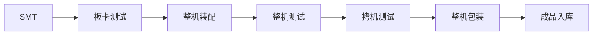
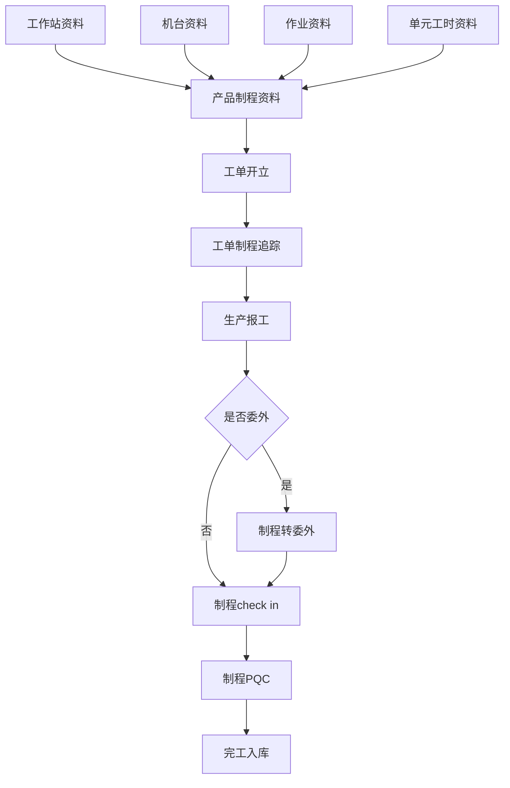

# OM 05 Assignment

## 目录

[TOC]

## 1. 描述你所在的组织或者你所熟悉的一个组织（如学校）的一个生产运作流程，并用流程图表示。

工厂生产一个产品的流程，主要是由SMT（PCB电路板表贴电子元器件），板卡测试（确保主板SMT没出问题），整机装配（将整机完整的装起来），整机测试（初步验证整机功能），拷机测试（8~72h拷机验证机器稳定性，不同产品和批次的时间不一样），整机包装（将机器包装好），成品入库（将包装好的成品送入仓库保存）

工厂制程管理的流程

## 2. 作业交换时间与批量之间的关系是什么？作业交换时间的长短对生产运作流程效率的影响是什么？

 作业交换时间与批量的大小**无关**，而设备的有效运行时间是与批量成正比的。批量的不同安排方法会影响产品的生产节拍和生产周期。批量之间所需的作业交换时间也会影响产品的生产节拍和生产周期，有些情况下还会引起新的瓶颈。在不同的产品中，其影响的大小和计算方法要根据影响和制约因素再具体确定。作业交换时间可能只需要几分钟，也可能需要几个小时。由于在进行作业交换时设备无法执行有效的工作任务，它会影响设备的有效利用率，因此这部分时间应该越短越好。
如何合理安排作业交换时间和批量生产的次序，如果是订单拉动型，只能根据最急订单优先。如果是计划推动型，就根据瓶颈工位最佳利用效率来制定排程。 

 作业交换时间间接性的影响批量，若某公司作业交换时间则会影响到产出效率，客户对此工厂的订单将相应减少。
作业交换时间长则将拉长产品的节拍，节拍越高运作效率越低，单位时间的产量越少 

## 3. BPR与企业应用信息技术之间的关系是什么?现在有一种说法，企业为了引入ERP这样的信息管理系统，必须进行BPR。你任务正确吗？为什么？

https://wenku.baidu.com/view/4287489fb8f67c1cfad6b8e1.html

### 3.1BPR与IT之间的流程关系

IT作为BPR实现手段的功能和作用的主要应用:

①自动化处理。自动化技术可显著减少人力劳动、提高工作效率,被应用于企业业务的各个领域,是IT应用最为广泛的一种功能。

②信息处理。IT主要应用于从业务流程中提取、传递和存储可供分析的信息。目前常见的MIS软件、财务软件和数据仓库、数据挖掘技术等都属于此类范畴的应用。

③顺序控制。主要目的是将原有的串行业务并行处理,以减少业务循环的周期,它主要应用于产品的设计与制造领域。

④远程交互。IT使企业不必再为是采取集中还是分散的组织结构而困惑,网络与数据库技术的发展使信息可随时随地获取。

⑤监控与跟踪。IT也可用于企业对于关键业务信息的监控与跟踪处理。在自动化控制生产领域,IT可用于实时监控并跟踪生产状态,以防事故的发生。

⑥决策处理。企业的组织从层次结构向扁平结构的转变、生产车间向团队工作组的转变都要求员工们参与业务的决策,专家系统及决策支持系统使普通员工也能根据人工智能知识库进行决策。

⑦电子商务处理。多媒体技术和全球互联网络的发展使企业为客户提供更为及时便捷的服务。客户可通过企业网络主页查阅相关产品信息并通过电子数据交换(EDI)进行订货、索取发票等,而企业也可通过网络进行交互式的售后服务。

### 3.2BPR与IT之间的技术关系  

信息技术是流程再造的催化剂,具有强化再造影响的能力。 

## 4. AIOT在智能家电上应用，请举例说明。

 智能家居细分市场包括智能家电、智能影音、智能照明、家庭安防、智能连接与控制等多个方面。 

比如目前比较常见的智能门锁，使用人脸识别技术可以开门，联动其他AIoT设备在主人进门前根据环境自动调整家里的光照和空调以及热水器。

智能音箱，利用语音识别和声源定位，声纹识别等技术，识别主人的需求，对接各种IoT家电，进行实时的人机互动。

科沃斯和iRobot扫地机器人，智能学习，动态规划路线，带摄像头的版本还可以自动避开宠物和小孩。

海康威视萤石家用摄像头，利用AI技术可以对指定目标的移动和运动做出报警和提示，也可以在特定人出现在摄像头范围内时提醒用户。

## 5. 为什么说瓶颈会“漂移”?

但一个流程中的最严重的瓶颈被解决的时候，流程中有可能出现新的最严重的瓶颈。

## 6. 为什么一个设计好的生产运作流程需要不断的加以改进?

随着企业的成长和企业业务的扩张，以及供应链上下游的关系，还有市场需求量的变化，不同阶段的企业会遇到不同的瓶颈，一个设计好的生产运作流程也应当因地制宜在对应的时期进行相应的改进，以实现企业对应时间段的最大生产效率。

流程利用率=实际产出/设计能力

流程生产率=流程输出/流程输入

## 7. 举三个比较成功的无人店，对比分析无人店与普通有人店在流程上的特点。任意选择两个流程分析工具，对它们进行分析。

Amazon Go， 阿里无人超市“淘咖啡” ， 缤果盒子 ，微信无人店

 在“约束理论”的排程方法中，强调在瓶颈工序前增加在制品库存（WIP）的目的，就是充分保证瓶颈工序的运转，防止因等待物料输入而导致的瓶颈工序效率降低，从而降低整线的产出效率。 

 在“约束理论”的排程方法中，强调在瓶颈工序前增加在制品库存（WIP）的目的，就是充分保证瓶颈工序的运转，防止因等待物料输入而导致的瓶颈工序效率降低，从而降低整线的产出效率。 

## 8. 新技术应用时候会遇到的困境，请举一个实例来说明问题。

企业在已有的生产线上实行新的RoHS生产工艺，大幅提高产品的无铅工艺水平，但是随之而来的是工人和技术人员的不适应，以及技术水平无法跟上。

自助机使用的人脸算法，从单目摄像头升级到双目摄像头（IR+VL），又升级到结构光摄像头（ToF），其中的软件算法和相应的软件识别流程定制，以及对外围硬件电路的需求都随之产生非常大的变动，这对整个企业生产和研发都是一个很大的挑战。

## 9. 根据约束理论，为什么价格决策中最关键的就是要看瓶颈工序的产品信息？

 瓶颈工序是指生产流程中节拍（不是过程时间）最慢的工序，也就是限制整条产线产能的工序。瓶颈工序的产能小于或等于整条产线的产能，那么充分发挥瓶颈工序的产能效率就能提高产线的产出。 