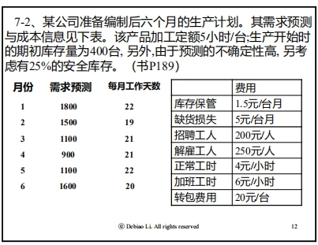
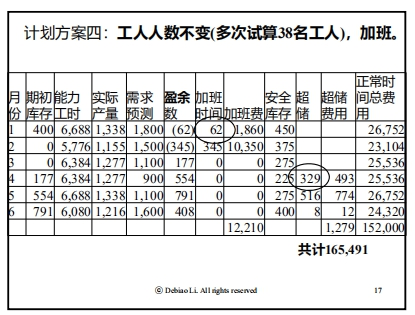
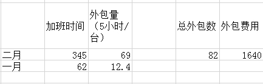
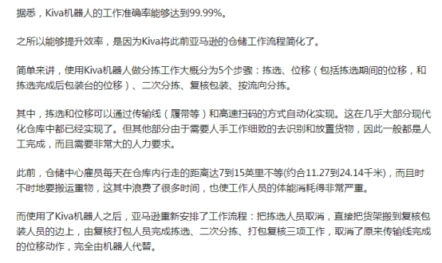

# OM 06 Assignment

## 1. 尝试7-2例题（P189-191），是否可以求得更优的解？

 

 

 

如图可以看出12月的时候加班费非常高，所以尝试在一月二月的时候超出部分外包，其他月份不变。

外包费用核算后：

 

165491-12210+1640=154921＜16000

 

 

## 2. 什么是预期库存？举例其应用。

预期库存（Anticipation inventory）是指诸如为迎接一个高峰销售季节、完成一次市场营销计划等而预先建立起来的库存，是为未来需要或限制生产速率变化而储备工时与时机。用于应对可预期的销售旺季或实施特殊促销计划。

 

为了应对双十一的井喷销售量，厂家提前备货。

 

## 3. Amazon Kiva 系统中存在哪些OM相关的问题？列举3个。 

https://zhuanlan.zhihu.com/p/26455055

使用Kiva机器人来进行仓储工作确实能够提升很多工作效率，但是这只是减少工作人员的压力和不必要的体能支出，并不能完全代替人类。

https://tech.qq.com/a/20160215/034786.htm

 

### 1）.业务流程重组bpr【仓储自动化】

 

 

https://www.lizhi.fm/39121383/2672350442409088518

要想让整个 Kiva System 顺利运行，必须解决以下3个问题：

怎么让货架移动？

分拣员的位置如何确定？

机器人之间如何沟通？

 

https://bbs.pinggu.org/thread-3569520-1-1.html

一方面，中国业界普遍承认自动化程度不高是制约中国物流发展的一大瓶颈，物流成本占到中国制造业总成本的15%—20%，美国则是个位数；另一方面，高智能的Kiva一到中国便被指太“超前”。

 

亚马逊仓库的自动化和智能化程度确实高于国内同行，但这是在有限规模的情况下做到的。而对于仍处于靠投资人输血维持阶段的大多数中国电商企业而言，仓库机器人每台30万元的价格显然不是小数目。

更重要的是，物流自动化是个系统工程，从分拣到配送要实现全流程自动化，前提是订单和货物流信息的快速处理和无缝对接。这个前提对于多数物流企业还没有真正解决，最多是在个别环节上实现了一定程度的智能化，比如智能机械手分拣，对系统效率的提升非常有限。

 

我们测算过，（仓库内）90%以上的走动都是浪费，所以要想办法让人站立不动，让设备过来。比如通过电动地牛等简单实现Kiva的功能。

 

如何讓Kiva 機器人和人類員工合作，就是新問題了。

 

## 4. 为什么说MRP II 或者 ERP模式的引入是一场管理变革？

ERP的实施对企业的经营战略、业务流程、组织结构、绩效考核体系、员工的工作方式都会产生巨大的影响，ERP是一种先进的管理模式。 

ERP实施成功的关键就是转变原有企业管理模式，软件本身并不能保证这种转变的实现，需要企业本身作出调整。所以ERP实施对企业来说不仅是引入一个计算机工具而已，而是一场管理变革，需要企业拥有足够的勇气做出这种改变。 

企业在实施ERP过程中存在的问题，认为实施ERP的关键就是转变原有企业管理模式，使ERP蕴含的先进的管理思想和最佳的管理实践于企业本身相结合，但是软件本身并不能保证这种转变，因此对企业来说，实施ERP就是一场管理变革。 

 

ERP是在MRPII的基础上，融合了先进的管理思想和信息技术，以“供应链管理"为核心思想，连接企业业务流程，整合企业内外部资源，实现了对整个供应链上物流、资金流、信息流的集成管理，通过对企业运行的实时监控，使企业的绩效得以持续改善。ERP成为集信息技术与先进的管理思想于一体的现在企业的运作模式。 

 

 

 

 

MRPII解决了财务与日常业务脱节的问题，做到了财务与业务同步，随时将企业

的运营状况通过资金运行状况反映出来，使企业决策层能够及时发现企业存在的问题。MRP II把企业的经营计划和生产计划结合起来，对企业制造的各种资源进行统一的计划和控制，使企业的物流、信息流、资金流流动顺畅。 

ERP在MRP II基础上，融合了供应链管理的思想，将信息集成的范围扩大到整个

供应链。ERP的核心思想是供应链管理，ERP将企业的制造流程看作是一个紧密相连的，完整的供应链，包括从原材料入厂到传递给最终消费者的全部环节；ERP不再是以职能部门作为企业的基本单元，而是将企业划分为许多相互协同工作的支持子系统，如财务、市场营销、生产控制、制造控制、服务维护、工程技术等。ERP将整个供应链都看作是企业的资源，它利用先进的信息技术，实时地采集和传递数据，对企业运行进行动态的实时监控；无缝的衔接企业的业务流程，消除各种无效的环节，降低了成本，提高了企业的运营效率。ERP扩展了管理的功能和范围，实现了对整个供应链上的物流、资金流、信息流的集成管理，满足了企业对于资源进行全面管理的要求。

 

## 5. 举一个例子说明MRP II 或者 ERP成功实施的关键要素。

战略、组织结构、业务流程、绩效考核体系构成了企业实施ERP过程中，进行管理变革的四个因素。

 

 

BPR是实施ERP的前提

1．ERP实现了整个供应链上的信息集成的要求 

2．ERP作为是一种流程管理工具的要求

ERP本身具有的属性使它能够支持以业务流程为主的工作方式。

ERP提供了一种与流程化相似的工作方式。 

3．最佳管理实践的要求

 

ERP提供商把最佳的管理实践固化到软件系统当中，从而优化了业务流程。而ERP

是一个标准化的软件系统，它的灵活性有限只能进行简单的配置，如果能对ERP进行大规模的修改那么也就失去了最佳管理实践的意义。为了把先进的业务流程引入企业当中来也需要重新梳理自己的业务流程，进行业务流程再造。 

 

组织结构变革保证EI冲实施企业的组织结构是指企业全体员工为实现企业目标，在工作中进行分工协作，在职能范围、责任、权力方面所形成的结构体系。企业的组织结构是企业发挥作用的支撑点，组织结构决定了企业中各种活动如何组织，企业中的资源如何分配，是企业生存和发展的基础。ERP系统的实施改变了员工的工作方式、权限的划分、职能结构，

重组了企业的业务流程，这样就要求企业从新设计自己的组织结构，以保证ERP系统的实施。

 

绩效考核体系的变革保证ERP的实施效果

在现代企业中最重要的资源就是员工。现在员工被称为人力资源，不再只是会计报表上的一项成本，作为资源的员工不但有价值而且要能够产生新的，更大的价值。因此，如何调动员工的积极性、最大发挥员工的潜力成为企业所面临的重要的问题。绩效考核的作用在于调动员工的积极性，引导员工的行为，保证工作的效果。企业实施ERP使员工的工作内容、工作方式都发生了变化，那么绩效考核体系也要改变，才能正确的引导员工的行为，保证企业实施ERP的效果。

 

 